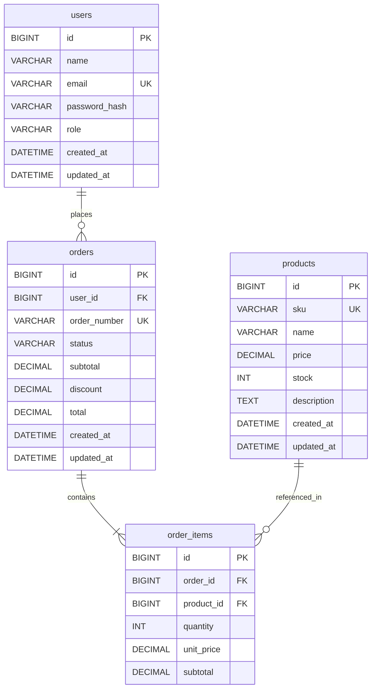

# Database Design - Order Management System

## ERD (Mermaid ER Diagram)



## Visual Layout Description

```
┌─────────────────────────────────────────────────────────────────────────────┐
│                                                                             │
│   ┌──────────────┐         ┌──────────────┐         ┌──────────────┐       │
│   │    USERS     │         │    ORDERS    │         │   PRODUCTS   │       │
│   ├──────────────┤         ├──────────────┤         ├──────────────┤       │
│   │ 🔑 id       │         │ 🔑 id       │         │ 🔑 id       │       │
│   │    name      │   1:N   │ 🔗 user_id  │         │    sku       │       │
│   │    email     │────────▶│    order_no  │         │    name      │       │
│   │    pass_hash │         │    status    │         │    price     │       │
│   │    role      │         │    subtotal  │         │    stock     │       │
│   │    created_at│         │    discount  │         │    description│      │
│   │    updated_at│         │    total     │         │    created_at│       │
│   └──────────────┘         │    created_at│         │    updated_at│       │
│                            │    updated_at│         └──────┬───────┘       │
│                            └──────┬───────┘                │               │
│                                   │ 1:N                    │ 1:N           │
│                                   ▼                        ▼               │
│                            ┌──────────────┐                                │
│                            │ ORDER_ITEMS  │                                │
│                            ├──────────────┤                                │
│                            │ 🔑 id        │                                │
│                            │ 🔗 order_id  │                                │
│                            │ 🔗 product_id│                                │
│                            │    quantity   │                                │
│                            │    unit_price │                                │
│                            │    subtotal   │                                │
│                            └──────────────┘                                │
│                                                                             │
└─────────────────────────────────────────────────────────────────────────────┘
```

## Cardinality Summary

| Relationship | Cardinality | Keterangan |
|---|---|---|
| users → orders | 1:N | Satu user memiliki banyak order |
| orders → order_items | 1:N | Satu order memiliki satu atau lebih item |
| products → order_items | 1:N | Satu product bisa muncul di banyak order item |

## Business Rules Enforcement

| Rule | Implementation |
|---|---|
| Email unique | UNIQUE constraint on `users.email` |
| SKU unique | UNIQUE constraint on `products.sku` |
| Price snapshot | `order_items.unit_price` menyimpan harga saat transaksi |
| Quantity > 0 | CHECK constraint `quantity > 0` |
| Stock >= 0 | CHECK constraint `stock >= 0` |
| Referential integrity | FOREIGN KEY constraints with CASCADE/RESTRICT |

## Presentation Guidelines

### Color Scheme (untuk PowerPoint)
- **Header tabel:** Dark navy (#1B2A4A) dengan text putih
- **Primary Key:** Bold, icon kunci emas (#F5A623)
- **Foreign Key:** Italic, icon link biru (#4A90D9)
- **Unique Key:** Underline, badge hijau (#27AE60)
- **Relationship lines:** Abu-abu gelap (#4A4A4A), 2px solid
- **Cardinality label:** Font 10pt, abu-abu medium
- **Background:** Putih bersih atau light grey (#F8F9FA)

### Typography
- **Table name:** Inter Bold 14pt, UPPERCASE
- **Column name:** Inter Regular 11pt
- **Data type:** Inter Light 9pt, warna abu-abu
- **Connector labels:** Inter Italic 9pt

### Layout Rules
- Users: posisi kiri-atas (entry point)
- Orders: posisi tengah (core entity)
- Order Items: posisi bawah-tengah (junction/detail)
- Products: posisi kanan-atas (reference data)
- Garis relationship tidak saling silang
- Spacing antar tabel minimal 80px
